# Diagrama Entidad-Relación - Sistema de Gestión de Proyectos

Este diagrama representa el modelo de datos completo para un sistema de gestión de proyectos similar a ClickUp o Jira.

```mermaid
erDiagram
    %% Entidades de Usuarios y Autenticación
    USER {
        string id PK
        string email UK
        string password
        string firstName
        string lastName
        string avatar
        string phone
        string timezone
        string locale
        boolean isActive
        datetime lastLogin
        datetime createdAt
        datetime updatedAt
    }

    ROLE {
        string id PK
        string name UK "e.g., ADMIN, PROJECT_MANAGER, DEVELOPER, VIEWER"
        string description
        json permissions
        datetime createdAt
        datetime updatedAt
    }

    USER_ROLE {
        string id PK
        string userId FK
        string roleId FK
        string organizationId FK
        datetime assignedAt
    }

    %% Entidades de Organización
    ORGANIZATION {
        string id PK
        string name
        string slug UK
        string description
        string logo
        json settings
        string subscriptionPlan
        datetime subscriptionExpiresAt
        datetime createdAt
        datetime updatedAt
    }

    ORGANIZATION_MEMBER {
        string id PK
        string organizationId FK
        string userId FK
        string status "ACTIVE, INVITED, SUSPENDED"
        datetime joinedAt
        datetime invitedAt
        string invitedBy FK
    }

    %% Entidades de Equipos
    TEAM {
        string id PK
        string organizationId FK
        string name
        string description
        string avatar
        datetime createdAt
        datetime updatedAt
    }

    TEAM_MEMBER {
        string id PK
        string teamId FK
        string userId FK
        string role "LEAD, MEMBER"
        datetime joinedAt
    }

    %% Entidades de Proyectos
    PROJECT {
        string id PK
        string organizationId FK
        string teamId FK
        string name
        string key UK "e.g., PROJ-001"
        string description
        string status "PLANNING, ACTIVE, ON_HOLD, COMPLETED, ARCHIVED"
        string visibility "PUBLIC, PRIVATE"
        string ownerId FK
        datetime startDate
        datetime dueDate
        json customFields
        datetime createdAt
        datetime updatedAt
    }

    PROJECT_MEMBER {
        string id PK
        string projectId FK
        string userId FK
        string role "OWNER, ADMIN, MEMBER, VIEWER"
        datetime joinedAt
    }

    %% Entidades de Espacios de Trabajo
    WORKSPACE {
        string id PK
        string projectId FK
        string name
        string description
        int orderIndex
        datetime createdAt
        datetime updatedAt
    }

    %% Entidades de Listas/Tableros
    LIST {
        string id PK
        string workspaceId FK
        string name
        string type "LIST, BOARD, GANTT, CALENDAR"
        string color
        int orderIndex
        json settings
        datetime createdAt
        datetime updatedAt
    }

    %% Entidades de Tareas
    TASK {
        string id PK
        string listId FK
        string projectId FK
        string key UK "e.g., PROJ-123"
        string title
        text description
        string type "TASK, BUG, FEATURE, EPIC, STORY"
        string priority "LOW, MEDIUM, HIGH, URGENT"
        string status "TODO, IN_PROGRESS, IN_REVIEW, BLOCKED, DONE, CANCELLED"
        string assigneeId FK
        string reporterId FK
        string parentId FK "Para subtareas"
        int estimatedHours
        int actualHours
        int storyPoints
        datetime startDate
        datetime dueDate
        datetime completedAt
        int orderIndex
        json customFields
        datetime createdAt
        datetime updatedAt
    }

    TASK_DEPENDENCY {
        string id PK
        string taskId FK "Tarea dependiente"
        string dependsOnTaskId FK "Tarea de la que depende"
        string type "BLOCKS, BLOCKED_BY, RELATES_TO, DUPLICATES"
        datetime createdAt
    }

    %% Entidades de Subtareas
    SUBTASK {
        string id PK
        string taskId FK
        string title
        string status "TODO, DONE"
        string assigneeId FK
        int orderIndex
        datetime createdAt
        datetime updatedAt
    }

    %% Entidades de Estados Personalizados
    WORKFLOW_STATUS {
        string id PK
        string projectId FK
        string name
        string color
        string type "TODO, IN_PROGRESS, DONE, CANCELLED"
        int orderIndex
        datetime createdAt
        datetime updatedAt
    }

    %% Entidades de Etiquetas
    TAG {
        string id PK
        string organizationId FK
        string name
        string color
        datetime createdAt
        datetime updatedAt
    }

    TASK_TAG {
        string id PK
        string taskId FK
        string tagId FK
        datetime assignedAt
    }

    %% Entidades de Comentarios
    COMMENT {
        string id PK
        string taskId FK
        string userId FK
        text content
        string type "COMMENT, SYSTEM"
        json mentions
        datetime createdAt
        datetime updatedAt
        datetime deletedAt
    }

    %% Entidades de Adjuntos
    ATTACHMENT {
        string id PK
        string taskId FK
        string commentId FK
        string userId FK
        string fileName
        string fileType
        string fileUrl
        int fileSize
        datetime uploadedAt
    }

    %% Entidades de Actividad/Historial
    ACTIVITY_LOG {
        string id PK
        string entityType "TASK, PROJECT, COMMENT, etc"
        string entityId
        string userId FK
        string action "CREATED, UPDATED, DELETED, ASSIGNED, etc"
        json changes
        string ipAddress
        datetime createdAt
    }

    %% Entidades de Time Tracking
    TIME_ENTRY {
        string id PK
        string taskId FK
        string userId FK
        text description
        int duration "en minutos"
        datetime startTime
        datetime endTime
        boolean isBillable
        datetime createdAt
        datetime updatedAt
    }

    %% Entidades de Sprints
    SPRINT {
        string id PK
        string projectId FK
        string name
        text goal
        string status "PLANNED, ACTIVE, COMPLETED"
        datetime startDate
        datetime endDate
        datetime createdAt
        datetime updatedAt
    }

    SPRINT_TASK {
        string id PK
        string sprintId FK
        string taskId FK
        datetime addedAt
    }

    %% Entidades de Plantillas
    TEMPLATE {
        string id PK
        string organizationId FK
        string createdBy FK
        string name
        string description
        string type "PROJECT, TASK, WORKFLOW"
        json structure
        string visibility "PUBLIC, PRIVATE, ORGANIZATION"
        int usageCount
        datetime createdAt
        datetime updatedAt
    }

    %% Entidades de Notificaciones
    NOTIFICATION {
        string id PK
        string userId FK
        string type "TASK_ASSIGNED, COMMENT_MENTION, DUE_DATE, etc"
        string title
        text message
        string entityType
        string entityId
        boolean isRead
        datetime readAt
        datetime createdAt
    }

    NOTIFICATION_PREFERENCE {
        string id PK
        string userId FK
        string notificationType
        boolean email
        boolean push
        boolean inApp
        datetime createdAt
        datetime updatedAt
    }

    %% Entidades de Webhooks
    WEBHOOK {
        string id PK
        string organizationId FK
        string projectId FK
        string name
        string url
        json events
        string secret
        boolean isActive
        datetime lastTriggeredAt
        datetime createdAt
        datetime updatedAt
    }

    WEBHOOK_LOG {
        string id PK
        string webhookId FK
        string event
        json payload
        int statusCode
        text response
        boolean success
        datetime createdAt
    }

    %% Entidades de Campos Personalizados
    CUSTOM_FIELD {
        string id PK
        string organizationId FK
        string projectId FK
        string name
        string type "TEXT, NUMBER, DATE, SELECT, MULTI_SELECT, USER, CHECKBOX"
        json options
        boolean isRequired
        datetime createdAt
        datetime updatedAt
    }

    TASK_CUSTOM_FIELD_VALUE {
        string id PK
        string taskId FK
        string customFieldId FK
        text value
        datetime updatedAt
    }

    %% Entidades de Automatizaciones
    AUTOMATION {
        string id PK
        string projectId FK
        string name
        string description
        json trigger
        json conditions
        json actions
        boolean isActive
        int executionCount
        datetime lastExecutedAt
        datetime createdAt
        datetime updatedAt
    }

    %% Entidades de Reportes y Dashboards
    DASHBOARD {
        string id PK
        string organizationId FK
        string projectId FK
        string userId FK
        string name
        string type "PERSONAL, PROJECT, ORGANIZATION"
        json widgets
        boolean isDefault
        datetime createdAt
        datetime updatedAt
    }

    %% Relaciones - Usuarios y Roles
    USER ||--o{ USER_ROLE : has
    ROLE ||--o{ USER_ROLE : assigned
    ORGANIZATION ||--o{ USER_ROLE : contains

    %% Relaciones - Organización
    ORGANIZATION ||--o{ ORGANIZATION_MEMBER : has
    USER ||--o{ ORGANIZATION_MEMBER : belongs
    USER ||--o{ ORGANIZATION_MEMBER : invites

    %% Relaciones - Equipos
    ORGANIZATION ||--o{ TEAM : contains
    TEAM ||--o{ TEAM_MEMBER : has
    USER ||--o{ TEAM_MEMBER : belongs

    %% Relaciones - Proyectos
    ORGANIZATION ||--o{ PROJECT : owns
    TEAM ||--o| PROJECT : manages
    USER ||--o{ PROJECT : owns
    PROJECT ||--o{ PROJECT_MEMBER : has
    USER ||--o{ PROJECT_MEMBER : participates

    %% Relaciones - Espacios y Listas
    PROJECT ||--o{ WORKSPACE : contains
    WORKSPACE ||--o{ LIST : contains

    %% Relaciones - Tareas
    LIST ||--o{ TASK : contains
    PROJECT ||--o{ TASK : has
    USER ||--o{ TASK : assigned
    USER ||--o{ TASK : reports
    TASK ||--o{ TASK : parent
    TASK ||--o{ TASK_DEPENDENCY : has
    TASK ||--o{ TASK_DEPENDENCY : depends

    %% Relaciones - Subtareas
    TASK ||--o{ SUBTASK : contains
    USER ||--o{ SUBTASK : assigned

    %% Relaciones - Estados
    PROJECT ||--o{ WORKFLOW_STATUS : defines

    %% Relaciones - Etiquetas
    ORGANIZATION ||--o{ TAG : defines
    TASK ||--o{ TASK_TAG : tagged
    TAG ||--o{ TASK_TAG : used

    %% Relaciones - Comentarios
    TASK ||--o{ COMMENT : has
    USER ||--o{ COMMENT : writes

    %% Relaciones - Adjuntos
    TASK ||--o{ ATTACHMENT : has
    COMMENT ||--o{ ATTACHMENT : has
    USER ||--o{ ATTACHMENT : uploads

    %% Relaciones - Actividad
    USER ||--o{ ACTIVITY_LOG : performs

    %% Relaciones - Time Tracking
    TASK ||--o{ TIME_ENTRY : tracks
    USER ||--o{ TIME_ENTRY : logs

    %% Relaciones - Sprints
    PROJECT ||--o{ SPRINT : has
    SPRINT ||--o{ SPRINT_TASK : contains
    TASK ||--o{ SPRINT_TASK : included

    %% Relaciones - Plantillas
    ORGANIZATION ||--o{ TEMPLATE : owns
    USER ||--o{ TEMPLATE : creates

    %% Relaciones - Notificaciones
    USER ||--o{ NOTIFICATION : receives
    USER ||--o{ NOTIFICATION_PREFERENCE : configures

    %% Relaciones - Webhooks
    ORGANIZATION ||--o{ WEBHOOK : configures
    PROJECT ||--o{ WEBHOOK : uses
    WEBHOOK ||--o{ WEBHOOK_LOG : generates

    %% Relaciones - Campos Personalizados
    ORGANIZATION ||--o{ CUSTOM_FIELD : defines
    PROJECT ||--o{ CUSTOM_FIELD : uses
    TASK ||--o{ TASK_CUSTOM_FIELD_VALUE : has
    CUSTOM_FIELD ||--o{ TASK_CUSTOM_FIELD_VALUE : stores

    %% Relaciones - Automatizaciones
    PROJECT ||--o{ AUTOMATION : has

    %% Relaciones - Dashboards
    ORGANIZATION ||--o{ DASHBOARD : has
    PROJECT ||--o{ DASHBOARD : has
    USER ||--o{ DASHBOARD : creates
```

## Descripción de Entidades Principales

### Módulo de Usuarios y Autenticación
- **USER**: Usuarios del sistema
- **ROLE**: Roles con permisos específicos
- **USER_ROLE**: Asignación de roles a usuarios en organizaciones

### Módulo de Organización
- **ORGANIZATION**: Empresas o grupos que usan el sistema
- **ORGANIZATION_MEMBER**: Miembros de una organización
- **TEAM**: Equipos dentro de una organización
- **TEAM_MEMBER**: Miembros de equipos

### Módulo de Proyectos
- **PROJECT**: Proyectos de software
- **PROJECT_MEMBER**: Participantes en proyectos
- **WORKSPACE**: Espacios de trabajo dentro de proyectos
- **LIST**: Listas, tableros, vistas Gantt, etc.

### Módulo de Tareas
- **TASK**: Tareas, bugs, features, epics, stories
- **SUBTASK**: Subtareas dentro de tareas
- **TASK_DEPENDENCY**: Dependencias entre tareas
- **WORKFLOW_STATUS**: Estados personalizados de workflow
- **TAG**: Etiquetas para categorizar tareas
- **TASK_TAG**: Asignación de etiquetas a tareas

### Módulo de Colaboración
- **COMMENT**: Comentarios en tareas
- **ATTACHMENT**: Archivos adjuntos
- **ACTIVITY_LOG**: Registro de actividades
- **TIME_ENTRY**: Registro de tiempo trabajado

### Módulo de Planificación
- **SPRINT**: Sprints/iteraciones ágiles
- **SPRINT_TASK**: Tareas asignadas a sprints

### Módulo de Configuración
- **TEMPLATE**: Plantillas reutilizables
- **CUSTOM_FIELD**: Campos personalizados
- **TASK_CUSTOM_FIELD_VALUE**: Valores de campos personalizados
- **AUTOMATION**: Reglas de automatización

### Módulo de Notificaciones
- **NOTIFICATION**: Notificaciones del sistema
- **NOTIFICATION_PREFERENCE**: Preferencias de notificación
- **WEBHOOK**: Webhooks para integraciones
- **WEBHOOK_LOG**: Log de ejecución de webhooks

### Módulo de Reportes
- **DASHBOARD**: Dashboards personalizados con widgets
